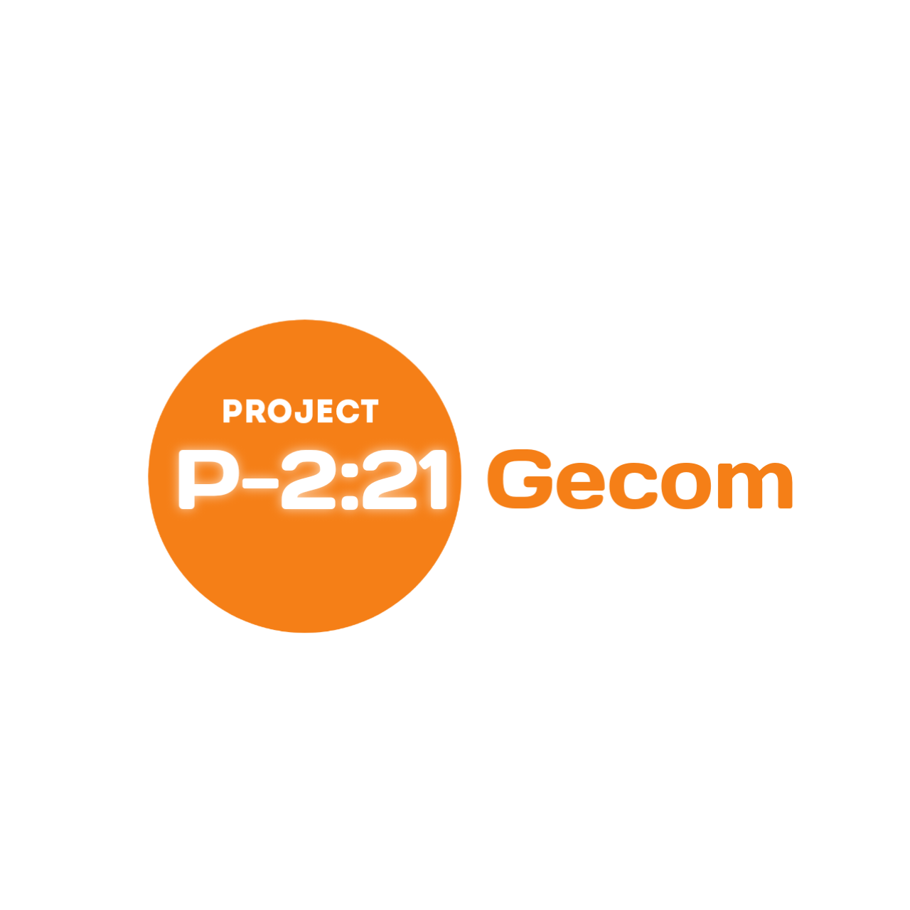
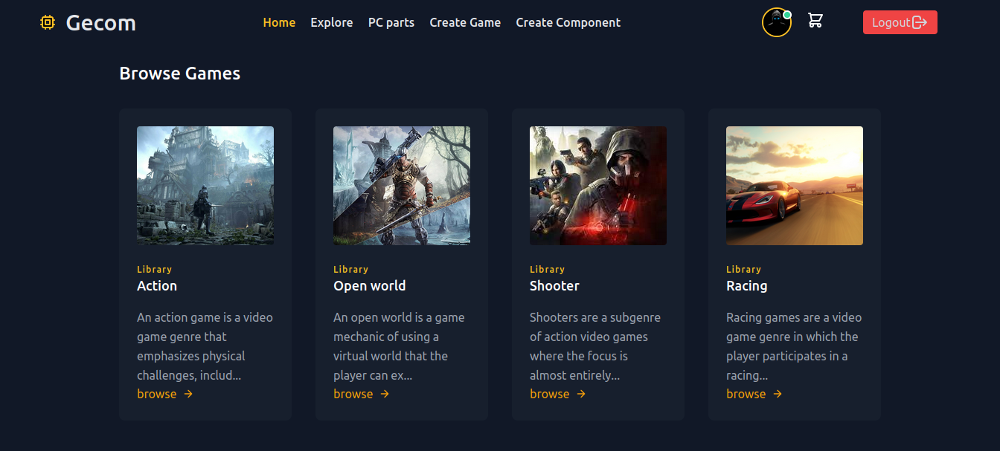
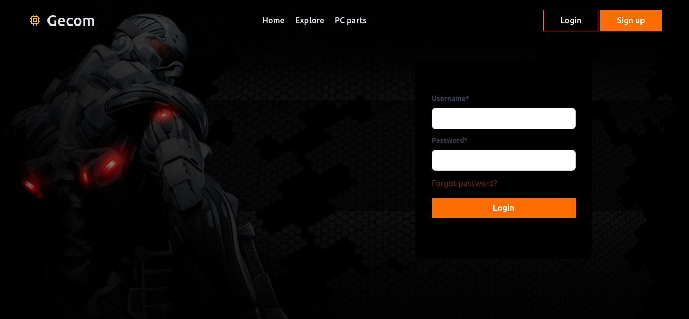

# Client-Gecom 

 

Gecom is Games and PC component <b>Concept</b> store.

**Resources**
   
 - [Read project overview (Developers)](https://github.com/alexdeathway/Gecom/blob/dev-unstable/docs/contribution/overview.md).    
 - [Choose Tasks/Quests](https://github.com/alexdeathway/Gecom/blob/dev-unstable/docs/contribution/quests.md)

## Screenshots
**Home Page Section** 

**Home Page Section** 

**Login Page** 

---

**Bring Site up [local host]**
1. Create .env file(use template.env for refrence).

2. Start Docker     

> sudo docker-compose build

> sudo docker-compose up

**Quick development Guide**

1. Create virtual environment

> virtualenv < virtual environment name>

2. Install required packages

> pip install -r requirements.txt

3. Read the [project overview](https://github.com/alexdeathway/Gecom/blob/dev-unstable/docs/contribution/overview.md) for app & structure understanding. 
4. Create .env file in project root dir and fill/copy content from template.env.

5.Load development Database

>python manage.py loaddata db.json

6. Choose issue/task to work from [quests or work](https://github.com/alexdeathway/Gecom/blob/dev-unstable/docs/contribution/quests.md) on own feature.

---
