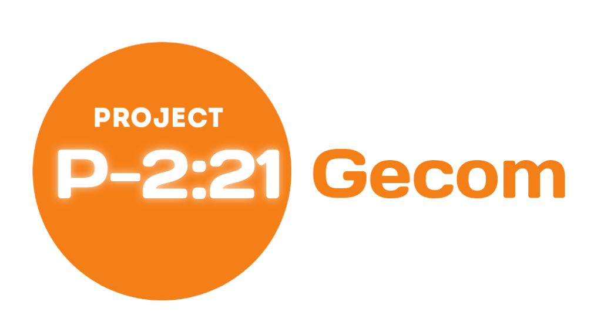
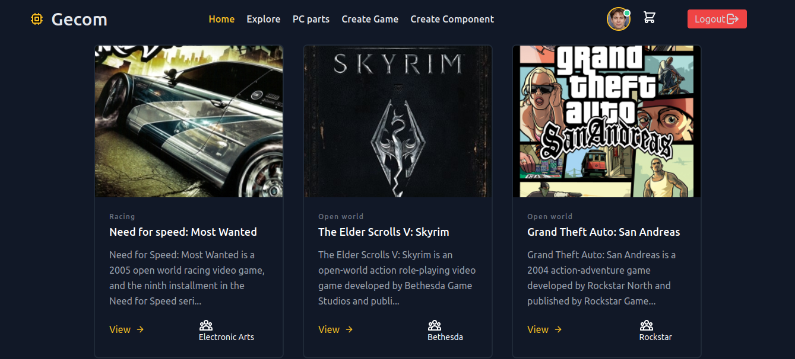

# Client-Gecom 

Gecom is Games and PC component <b>Concept</b> store.

**Resources**
   
 - [Read project overview (Developers)](https://github.com/alexdeathway/Gecom/blob/dev-unstable/docs/contribution/overview.md).    
 - [Choose Tasks/Quests](https://github.com/alexdeathway/Gecom/blob/dev-unstable/docs/contribution/quests.md)

## Screenshots
**Home Page Section** 

**Home Page Section** 

---

**Quick development Guide**

1. Create virtual environment
> virtualenv < virtual environment name>

2. Install required packages
> pip install -r requirements.txt
3. Read project overview for app & structure understanding. 

4. Choose issue/task to work from quests or work on own feature.

